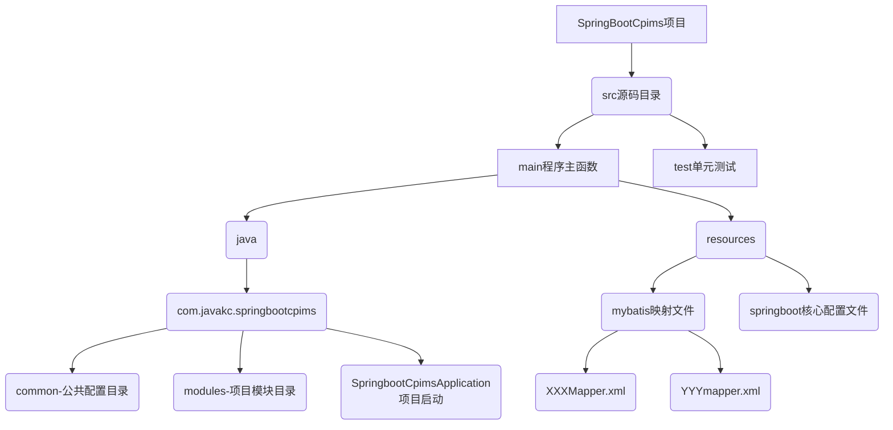

# 建设项目信息管理系统

## 项目结构

## 项目框架

├── spring全家桶
│   ├── spring-framework
│   ├── spring-boot
│   ├── spring-data
│   └── spring-security
├── 数据库相关
│   ├── mybatis
│   └── druid
└── 。。。。。。

## 热部署配置

_____________

热部署配置
File - Settings - Build - Compiler - Build project automatically(勾选)
ctrl + shift + alt + /, 选择Registry, Compiler autoMake allow when app running(勾选) 

_____________

## 项目访问地址
*druid:* http://localhost:8080/druid/index.html  
*swagger:* http://localhost:8080/swagger-ui/index.html  
